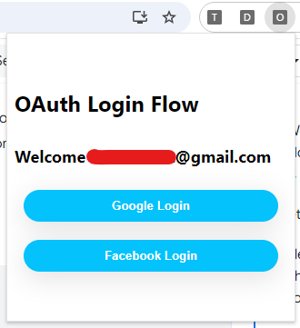
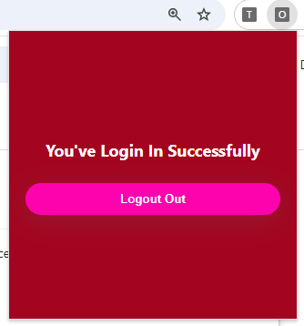
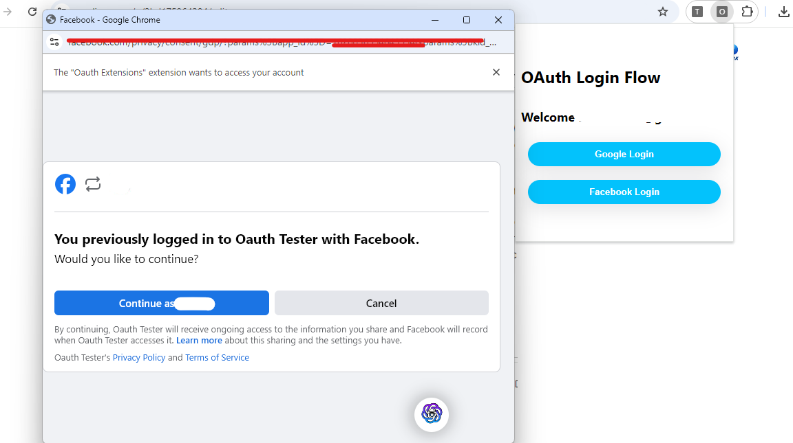

# OAuth Extension
Learn to use Google OAuth and Other Login OAuth Flow in Your chrome extensions.

In this project we are going to build a base framework for an extension with a Google and Facebook login page and a main page once they have logged in.







You'll need to replace the `client_id` for <b>Google</b> in `manifest.json` and the `client_id` for <b>Facebook</b> in the `script.js` with your own.


## Facebook Login Flow
You can read Facebook's Manual Build a Login Flow documentation here:
```
https://developers.facebook.com/docs/facebook-login/guides/advanced/manual-flow/
```